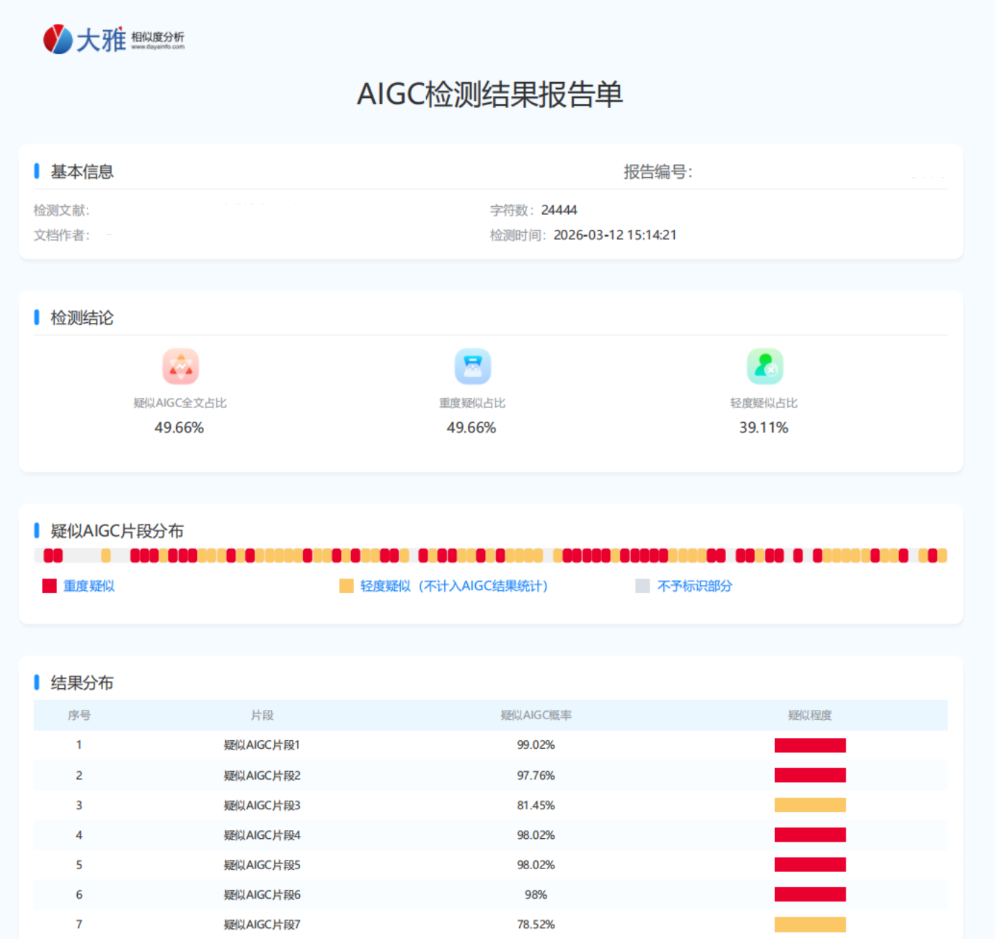

# 论文写作表达优化工具箱（本地 Web + CLI）

> 面向论文/技术文档的本地表达优化工具：分段处理、实时流式对比、可视化差异展示、支持 Web 与命令行。

---

## 背景

在论文写作与技术文档整理中，很多人希望把表达做得更清晰、更系统，同时尽量降低重复劳动。这个项目提供了一个“可本地运行”的工具箱：把长文按段拆分、调用 LLM 进行表达优化，并把原文/改写/差异在页面里实时展示。

## 准备论文正文的两种方式

1. **（推荐）网页上传 Word**：在页面「数据预处理」中上传 `.docx`，程序会提取**正文纯文本**（不保留图片），覆盖写入同目录下的 `论文.txt`。
2. **手动编辑**：把正文粘贴到 `论文.txt`，保存后再点「开始改写」。

改写完成后，在页面下载结果，或到 `outputs/` 文件夹取 `改写结果_*.txt`，再贴回 Word。

### Word 上传的限制说明

- 仅解析 **正文**中的段落与表格文字；**页眉、页脚、脚注、批注、文本框**等通常不在提取范围内，若发现缺字请改用手动粘贴或调整 Word 结构。
- 图片本身不包含可提取文字，上传后不会出现在 `论文.txt` 中。

---

## 项目简介

本工具会读取你的 `论文.txt`，按规则切分为小段（每段不超过 250 字），并发调用 LLM 改写，然后在网页中实时展示：

- 原文
- 改写后
- 差异高亮
- 任务进度与导出结果

默认推荐提示词：`prompts/论文修改助手.txt`。  
如果 `prompt.txt` 为空或不存在，程序会自动初始化为这份提示词。

### 仓库结构（简）

| 路径 | 说明 |
|------|------|
| `server.py` | FastAPI 应用入口（路由、静态资源、生命周期） |
| `paper_rewrite/` | 后端逻辑包：路径与日志、配置、分段任务、LLM、Word 提取 |
| `static/`、`templates/` | 前端静态页与模板 |
| `prompts/` | 内置提示词模板 |
| `tests/` | `pytest` 冒烟、`qa_smoke.py` 手工测试、可选 LLM 联调脚本 |
| `docs/` | 文档；**版本级变更见 [docs/更新说明.md](docs/更新说明.md)** |

---

## 安装与快速上手（推荐给 `pip` 用户）

1. 安装（本地开发/源码安装）：`pip install -e .`
2. 配置 API Key（任选其一）：环境变量 `OPENAI_API_KEY` / `AI_API_KEY`，或写入 `default.yaml` 的 `api_key`
3. 准备输入：在运行目录放置 `论文.txt`（或通过 Web 页面上传 `.docx`，会写入 `论文.txt`）
4. 启动与使用：
   - Web：`paper-rewrite serve`
   - 诊断：`paper-rewrite doctor`
   - 命令行改写：`paper-rewrite rewrite --in 论文.txt --out outputs/改写结果.txt`

---

## 效果展示

### 降 AI 前



### 降 AI 后


---

## 核心能力

- 分段改写：单段长度自动控制在 `<=250`
- 短段合并：自动合并超短段，减少无效请求
- 并发可控：并发上限 `10`
- 实时流式：SSE 即时返回，不必等待全部完成
- 对比可视：原文 / 改写 / diff 同屏查看
- 结果导出：一键下载完整改写文本

---

## 快速开始（无代码用户）

准备正文：上传 `.docx` 或编辑 `论文.txt`（二选一）。

### 方式 A：源码一键启动（推荐）

1. 安装 Python 3.10+
2. 双击 `start.bat`
3. 浏览器会自动打开 `http://127.0.0.1:8000`
4. 点击页面“开始改写”

### 方式 B：EXE 发行版（给普通用户）

开发者打包后会得到 `dist/release/`，用户只需：

1. 双击 `run_exe.bat`
2. 浏览器自动打开页面
3. 按页面提示操作

---

## 使用说明

### 1) 准备文件

- `论文.txt`：待改写正文（可由页面上传 Word 自动生成）
- `prompt.txt`：生效提示词
- `default.yaml`：模型配置（支持多种 LLM API）

生成参数（可选，见 `default.yaml.example`）：

- `temperature`：采样温度（默认 `0.7`）
- `request_timeout_sec`：单次 LLM 请求超时秒数（默认 `120`，范围约 5～600）
- `max_tokens`：部分模型支持的最大输出 token（`null` 表示不强制传该字段）
- `anthropic_max_tokens`：仅 Claude 接口使用的 `max_tokens`（默认 `2048`）

任务与内存：服务端在内存中保留**最近约 20 个**改写任务；更早的任务 ID 会失效，下载结果需使用新任务。进程重启后任务列表清空。

### 2) 选择 LLM API 提供商（先区分“协议类型”和“厂商”）

当前支持：

- `openai_compatible`：**OpenAI 兼容协议类型**（不是某一家厂商）
  - 可接入：OpenAI、阿里云 DashScope 兼容模式、DeepSeek、Moonshot、SiliconFlow、OpenRouter 等
- `anthropic`：Claude 官方接口
- `gemini`：Google Gemini 官方接口

你只需要修改 `default.yaml` 的 `model_provider`、`api_base`、`model` 即可。

#### A. OpenAI 兼容接口（推荐，覆盖最广）

```yaml
models:
  default_chat_model:
    model_provider: openai_compatible
    api_key: ""
    model: qwen3-max
    api_base: https://dashscope.aliyuncs.com/compatible-mode/v1
```

上面这个 `api_base` 是**阿里云 DashScope 的 OpenAI 兼容地址**。  
如果你切换到其他兼容平台，只需替换 `api_base` 和 `model`，`model_provider` 仍保持 `openai_compatible`。

#### B. Anthropic（Claude）

```yaml
models:
  default_chat_model:
    model_provider: anthropic
    api_key: ""
    model: claude-3-5-sonnet-latest
    api_base: https://api.anthropic.com/v1
```

#### C. Gemini

```yaml
models:
  default_chat_model:
    model_provider: gemini
    api_key: ""
    model: gemini-1.5-pro
    api_base: https://generativelanguage.googleapis.com/v1beta
```

### 3) 配置 API Key（推荐环境变量）

```bash
set OPENAI_API_KEY=你的key
```

也支持写入 `default.yaml` 的 `api_key` 字段（不建议公开仓库存真实 key）。

### 4) 切换提示词

从 `prompts/` 里任选一个，把内容复制到 `prompt.txt` 即可。  
推荐：`prompts/论文修改助手.txt`。

---

## 开发者打包发行

1. 双击 `build_release.bat`
2. 打包完成后产物在 `dist/release/`
3. 把 `dist/release/` 整个目录发给用户即可

## 维护与发布

- **版本与变更记录**：[docs/更新说明.md](docs/更新说明.md)
- **维护者发布流程**（打包 EXE、发布前检查等）：[docs/RELEASE.md](docs/RELEASE.md)
- **贡献指南**：[CONTRIBUTING.md](CONTRIBUTING.md)
- **安全报告**：[SECURITY.md](SECURITY.md)
- **行为准则**：[CODE_OF_CONDUCT.md](CODE_OF_CONDUCT.md)
- **CI（GitHub Actions）**：自动运行 `pytest`（见 `.github/workflows/ci.yml`）

---

## 安全与隐私

- `logs/`、`outputs/`、`dist/`、`build/` 已加入 `.gitignore`
- `default.yaml`、`prompt.txt`、`论文.txt` 默认加入 `.gitignore`（避免误传本地数据）
- 建议仅使用环境变量注入 API Key
- 仓库中建议保留 `default.yaml.example` 作为配置模板
- **本工具默认面向本机使用**：请勿将服务绑定到公网或不可信网络；若必须局域网访问，需自行评估上传接口与改写接口的滥用风险（无登录鉴权）。

---

## 常见问题

- **前端没有实时数据**：查看 `logs/server.log` 是否有 `api_stream_emit`
- **启动失败**：确认 Python 已加入 PATH
- **请求报错**：检查 `model_provider`、`api_base`、`model`、`OPENAI_API_KEY`

---

作者主页：[wzm110](https://github.com/wzm110)
